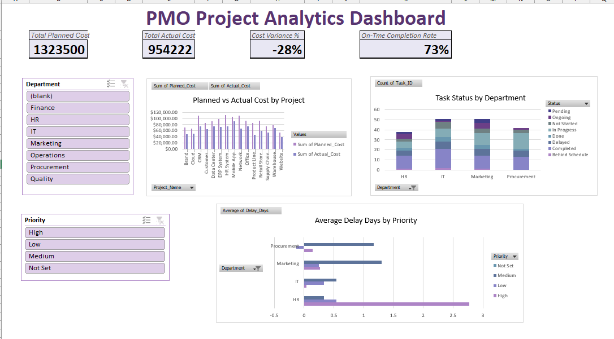

# 📊 PM Analytics Practice Project Dashboard

## 📌 Overview

This project was developed as part of the **Advanced Data Analytics Training** at the **National Telecommunication Institute (NTI)**.

The dashboard was built using **Microsoft Excel** to provide an interactive overview of project performance through key performance indicators (KPIs), charts, and dynamic filters, helping users monitor project progress and support better decision-making.

---

## 🛠️ Tools & Technologies

- Microsoft Excel
- Power Query
- Pivot Tables
- Pivot Charts
- Interactive Slicers
- KPI Cards
- Data Visualization

---

## 📈 Dashboard Highlights

- Planned Cost vs. Actual Cost
- Cost Variance (%)
- On-Time Completion Rate
- Task Status by Department
- Average Delay Days by Priority
- Interactive Filters for Project Analysis

---

## 📷 Dashboard Preview

---

## 🎯 Skills Demonstrated

- Data Cleaning
- Data Transformation
- Dashboard Design
- KPI Reporting
- Interactive Reporting
- Business Analytics

---

## 👩‍💻 Author

**Milisia Makram**

Advanced Data Analytics Trainee @ National Telecommunication Institute (NTI)
